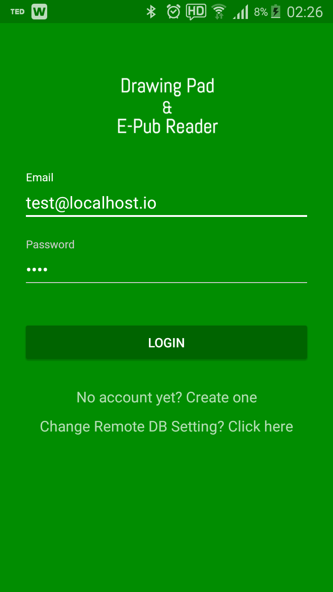
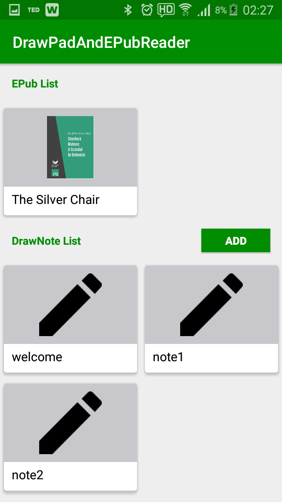
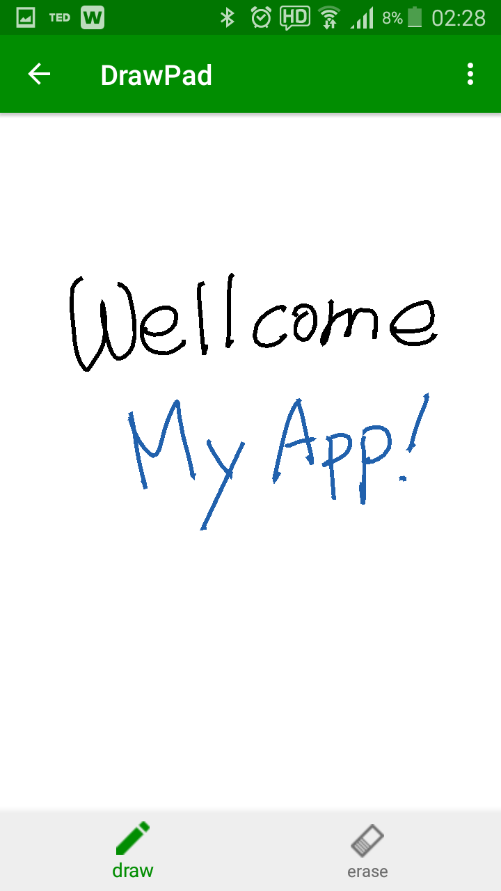
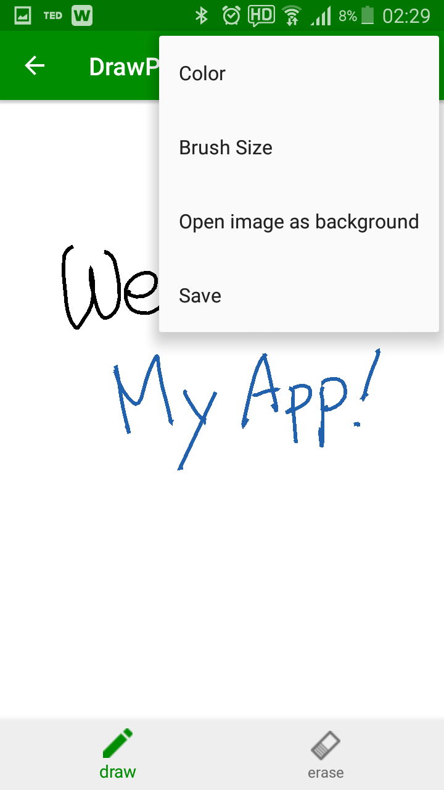
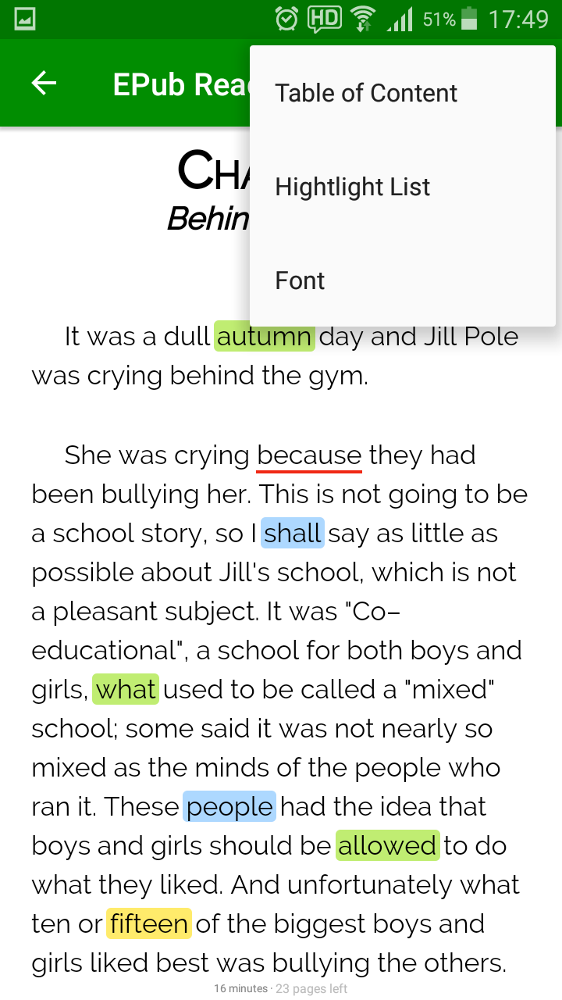
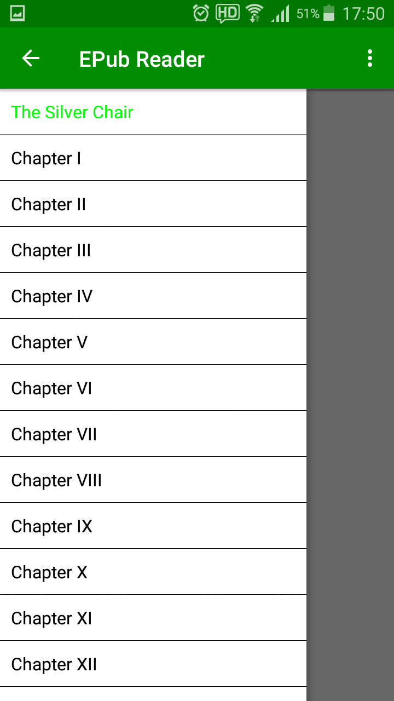
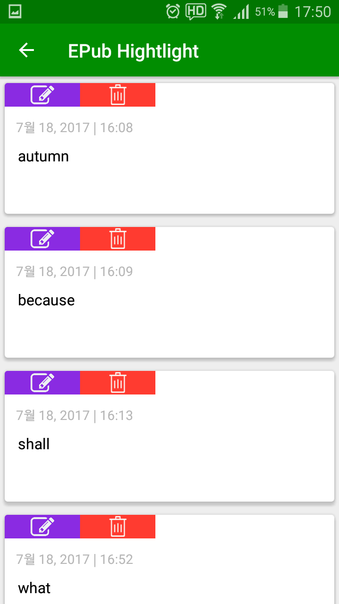
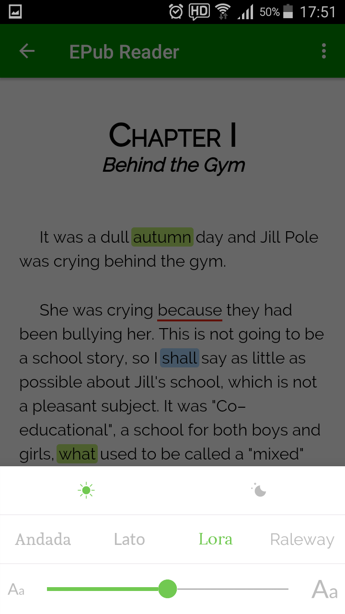

# DrawPadAndEPubReader_android 

## Features

This is my personal project for implementing an Android application with several features like
- Drawing Pad
- EPub Reader 
- Mobile Database
- Realtime Synchronization (Drawing Lines and EPub Hightlights)

A Realm soultion (https://realm.io) was used for Mobile Database and Realtime Synchronization. 

## Screenshot

  
  

  
  
  
  

  
  
  
  

## Prerequisites

- Build Realm Object Server (This is a database like SQL server) 
  * Install after downloading the current version 
  * Documentation & Download Url : https://realm.io/docs/get-started/

- Check IP, Port Nuamber of Realm Object Server and make a user in Realm Object Server for this service
  * The port number of Realm Object Server is 9080 
  * If Realm Object Server is localhost, the IP is 127.0.0.1.
  * If Realm Object Server is working at localhost, the admin web site is http://localhost:9080/
  * Create an admin user and then login the admin site with the admin user 
  * Create an other user for your service 
  
  * My configuration is :
  <pre><code>
    public static String realmServerIP = "127.0.0.1"; // your Realm Object Server IP
    public static String realmID = "demo@localhost.io"; // your Login ID of the Realm Object Server
    public static String realmPasswd = "demo1234"; // your Login Password of the Realm Object Server
  </code></pre>

## References

- Realm-Draw (https://github.com/realm/realm-java)
- Color Picker (https://github.com/kristiyanP/colorpicker)
- RecyclerView (https://github.com/luizgrp/SectionedRecyclerViewAdapter)
- EPub (https://github.com/FolioReader/FolioReader-Android)

