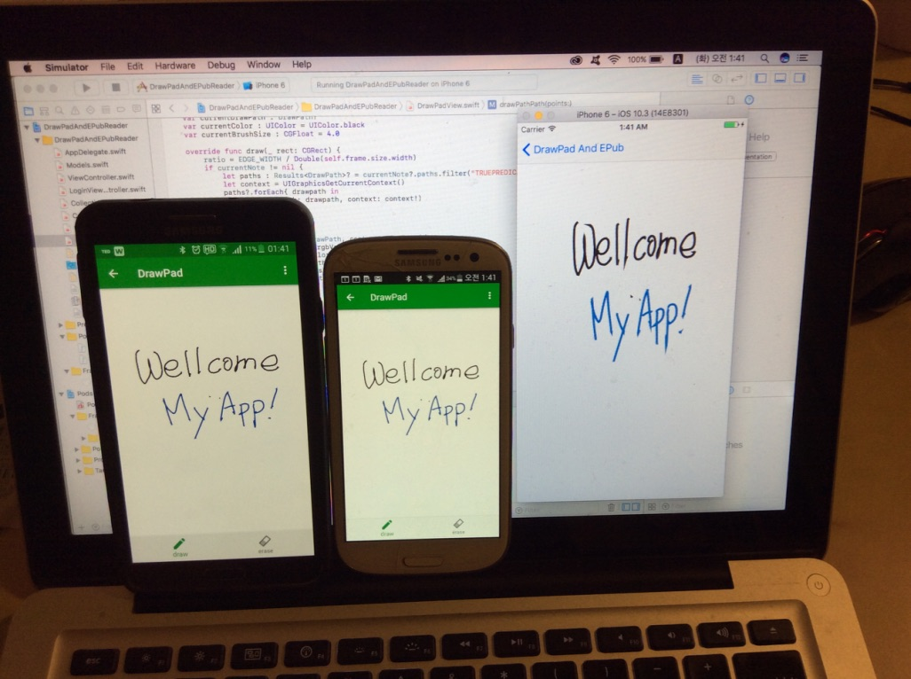

# DrawPadAndEPubReader_android

This is my personal project for implementing Android iOS applications with several features like

- Drawing Pad
- EPub Reader (it will be added soon)
- Mobile Database
- Realtime Synchronization

A Realm soultion (https://realm.io) was used for Mobile Database and Realtime Synchronization. 

  
  

  
  
  
  

